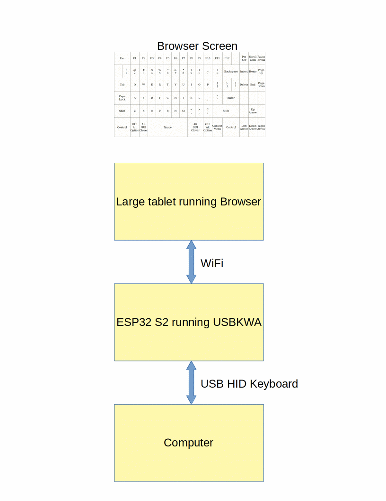
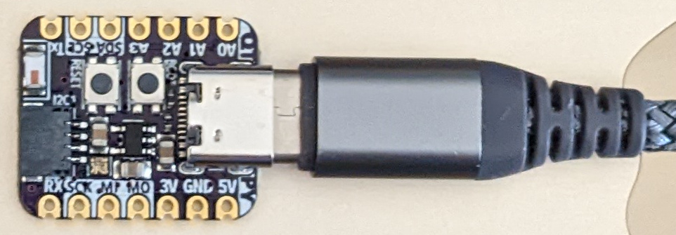
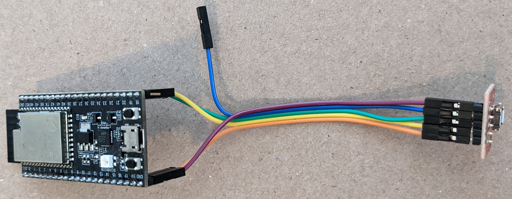

# USBKWA -- USB Keyboard Web App

USBKWA (USB Keyboard Web App) turns a large tablet or any device with a Web
browser into a USB keyboard. Anyone having difficulties using a regular
keyboard may find a touch keyboard easier to use. More than one browser
can be connected at the same time. A co-pilot can connect using a different
computer or tablet to help the pilot (primary user) fly the computer.

The first version used an Espressif ESP32-S2 Saola board which requires wiring
a USB connector break out board. The latest version use an "Adafruit QT Py
ESP32-S3 WiFi Dev Board with STEMMA QT - 8 MB Flash / No PSRAM" board. Using
the QT Py board means there is no need to wire in a USB connector. The built-in
USB Type C connector is all that is required.

[Screen capture of keyboard in browser window](./images/Screen_Keyboard.gif)

The keyboard web app displays a 17x6 grid in the browser window. The locations
of touch or mouse events are sent via a web socket back to the ESP32 web
server. The server translates locations to USB HID keycodes and sends them out
the USB HID keyboard interface.

The QT Py ESP32 S3 board is programmed using the Arduino IDE. No soldering or
wiring is required.

The ESP32 S2 Saola board is programmed using the Arduino IDE. No soldering is
required but a USB connector break out board must be wired to the Saola board.

The browser communicates to the ESP32 using WiFi. The ESP32 communicates with
the other computer using USB HID.

## Hardware

The QT Py ESP32-S3 is easier to use and has the option of supporting BLE HID
keyboard. The S3 has BLE (Bluetooth Low Energy) but the S2 does not.

### Adafruit QT Py ESP32-S3 board

No soldering or wiring is required. Just plug the board into the computer using
an appropriate USB cable.

### Espressif ESP32-S2 Saola board

On the Espressif Saola board, the USB micro connector is connected to a CP2102
USB Serial chip. The USB HID data is on pin 19 and 20. A separate USB connector
or cable must be connected to pins 19, 20, GND, and 5V. Do not use both
connectors at the same time. If there is no protection diode on the 5V
pin, board may be damaged. Connect to the built-in USB micro
connector to program the ESP32. Disconnect the cable then plug it into the
other USB micro connector to test the USB feature.

ESP32 S2 Saola      |USB micro connector
--------------------|---------------------
GND                 |GND
5V                  |VBUS
19 (USB D-)         |D-
20 (USB D+)         |D+
not connected       |ID

In the following photo, the USB connector is a SparkFun micro USB breakout board
connected to the ESP32 S2 Saola board using Dupont wires.

This should work on any ESP32 S2 board but has only been tested on the
Espressif Saola board. Regular ESP32 boards do not have native USB hardware so
will not work. The not yet released ESP32 S3 should also work.

* [ESP32-S2-Saola-1](https://docs.espressif.com/projects/esp-idf/en/latest/esp32s2/hw-reference/esp32s2/user-guide-saola-1-v1.2.html)
* [USB Device Driver](https://docs.espressif.com/projects/esp-idf/en/latest/esp32s2/api-reference/peripherals/usb_device.html)

## Software

* [Arduino IDE 1.8.19](https://www.arduino.cc/en/software)
* [Arduino ESP32 2.0.5](https://docs.espressif.com/projects/arduino-esp32/en/latest/installing.html#installing-using-boards-manager)

The following libraries can be installed using the IDE Library Manager.

* [WebSockets by Markus Sattler](https://github.com/Links2004/arduinoWebSockets)
* [ArduinoJson by Benoit Blanchon](https://arduinojson.org/)
* [WiFiManager by tzapu/tablatronix](https://github.com/tzapu/WiFiManager)

The library manager installs WiFiManager 2.0.14-beta which includes support
for Arduino-esp32 2.0.x and works on ESP32 S2 and S3 boards.
